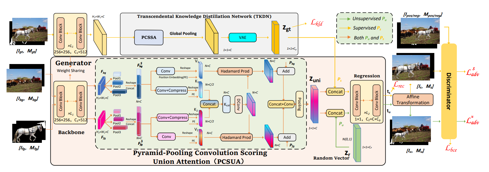

Learning Object Placement via Convolution Scoring Attention
========

Official PyTorch Implementation for **CSANet** (**C**onvolution **S**coring **A**ttention based **G**enerative **A**dversarial **N**etwork). 

The full code of CSANet will be uploaded until the paper is accepted.





# Pretrained Model 
We provide models for **TERSE** (CVPR 2019) [[arXiv]](https://arxiv.org/abs/1904.05475), **PlaceNet** (ECCV 2020) [[arXiv]](https://www.ecva.net/papers/eccv_2020/papers_ECCV/papers/123580562.pdf), **GracoNet**(ECCV 2022) [[arXiv]](https://arxiv.org/abs/2207.11464), **CA-GAN**(ICME 2023, Oral) [[paper]](https://ieeexplore.ieee.org/stamp/stamp.jsp?tp=&arnumber=10219885) and our **CSANet**:

<table>
  <thead>
    <tr style="text-align: right;">
      <th></th>
      <th>method</th>
      <th>FID</th>
      <th>LPIPS</th>
      <th>url of model & logs</th>
    </tr>
  </thead>
  <tbody>
    <tr>
      <th>0</th>
      <td>TERSE</td>
      <td>46.88</td>
      <td>0</td>
      <td><a href="https://pan.baidu.com/s/1muuU17NtCu_O_9L8slHgMw">baidu disk</a>&nbsp;(code: zkk8)</td>
    </tr>
    <tr>
      <th>1</th>
      <td>PlaceNet</td>
      <td>37.01</td>
      <td>0.161</td>
      <td><a href="https://pan.baidu.com/s/19_NTr0JFBCFr_X18vYs_cA">baidu disk</a>&nbsp;(code: rap8)</td>
    </tr>
    <tr>
      <th>2</th>
      <td>GracoNet</td>
      <td>28.10</td>
      <td>0.207</td>
      <td><a href="https://pan.baidu.com/s/1PxzTB2PoN4FRDOd-HgR-Yg">baidu disk</a>&nbsp;(code: cayr)</td>
    </tr>
    <tr>
      <th>3</th>
      <td>CA-GAN</td>
      <td>23.21</td>
      <td>0.268</td>
      <td><a href="https://pan.baidu.com/s/1wns3EO3pwnZdh-vhFJ3rkA">baidu disk</a>&nbsp;(code: 90yf)</td>
    </tr>
    <tr>
      <th>4</th>
      <td>CSANet</td>
      <td>20.88</td>
      <td>0.274</td>
      <td><a href="https://pan.baidu.com/s/1uXWPw4QXVF0g0b8PblljbA?pwd=l0e6">baidu disk</a>&nbsp;(code: l0e6)</td>
    </tr>
  </tbody>
</table>


# Usage

Install Python 3.6 and PyTorch 1.9.1 (require CUDA >= 10.2):
```
conda install pytorch==1.9.1 torchvision==0.10.1 torchaudio==0.9.1 cudatoolkit=10.2 -c pytorch
```


## Data preparation
Download and extract [OPA](https://github.com/bcmi/Object-Placement-Assessment-Dataset-OPA) dataset from the official link: [google drive](https://drive.google.com/file/d/133Wic_nSqfrIajDnnxwvGzjVti-7Y6PF/view?usp=sharing). We expect the directory structure to be the following:
```
<PATH_TO_OPA>
  background/       # background images
  foreground/       # foreground images with masks
  composite/        # composite images with masks
  train_set.csv     # train annotation
  test_set.csv      # test annotation
```

Then, make some preprocessing:
```
python tool/preprocess.py --data_root <PATH_TO_OPA>
```
You will see some new files and directories:
```
<PATH_TO_OPA>
  com_pic_testpos299/          # test set positive composite images (resized to 299)
  train_data.csv               # transformed train annotation
  train_data_pos.csv           # train annotation for positive samples
  test_data.csv                # transformed test annotation
  test_data_pos.csv            # test annotation for positive samples
  test_data_pos_unique.csv     # test annotation for positive samples with different fg/bg pairs 
```

## Training
To train CSANet on a single 3090 gpu with batch size 32 for 18 epochs, run:
```
python main.py --data_root <PATH_TO_OPA> --expid <YOUR_EXPERIMENT_NAME>
```
If you want to reproduce the baseline models, just replace ```main.py``` with ```main_terse.py``` / ```main_placenet.py``` / ```main_graconet.py``` / ```main_CA-GAN.py``` for training.

To see the change of losses dynamically, use TensorBoard:
```
tensorboard --logdir result/<YOUR_EXPERIMENT_NAME>/tblog --port <YOUR_SPECIFIED_PORT>
```

## Inference
To predict composite images from a trained CSANet model, run:
```
python infer.py --data_root <PATH_TO_OPA> --expid <YOUR_EXPERIMENT_NAME> --epoch <EPOCH_TO_EVALUATE> --eval_type eval
python infer.py --data_root <PATH_TO_OPA> --expid <YOUR_EXPERIMENT_NAME> --epoch <EPOCH_TO_EVALUATE> --eval_type evaluni --repeat 10
```
If you want to infer the baseline models, just replace ```infer.py``` with ```infer_terse.py``` / ```infer_placenet.py``` / ```infer_graconet.py```/ ```infer_CA-GAN.py```.

You could also directly make use of our provided models. For example, if you want to infer our best CSANet model, please 1) download ```CSANet.zip``` given above, 2) place it under ```result``` and uncompress it:
```
mv path/to/your/downloaded/CSANet.zip result/CSANet.zip
cd result
unzip CSANet.zip
cd ..
```
and 3) run:
```
python infer.py --data_root <PATH_TO_OPA> --expid CSANet --epoch 18 --eval_type eval
python infer.py --data_root <PATH_TO_OPA> --expid CSANet --epoch 18 --eval_type evaluni --repeat 10
```
The procedure of inferring our provided baseline models are similar. Remember to use ```--epoch 11``` for TERSE, GracoNet, ```--epoch 9``` for PlaceNet and ```--epoch 15``` for CA-GAN.

## Evaluation

To evaluate [FID](https://github.com/mseitzer/pytorch-fid) score, run:
```
sh script/eval_fid.sh <YOUR_EXPERIMENT_NAME> <EPOCH_TO_EVALUATE> <PATH_TO_OPA/com_pic_testpos299>
```
To evaluate [LPIPS](https://github.com/richzhang/PerceptualSimilarity) score, run:
```
sh script/eval_lpips.sh <YOUR_EXPERIMENT_NAME> <EPOCH_TO_EVALUATE>
```


# Acknowledgements
Some of the evaluation codes in this repo are borrowed and modified from [Faster-RCNN-VG](https://github.com/shilrley6/Faster-R-CNN-with-model-pretrained-on-Visual-Genome), [OPA](https://github.com/bcmi/Object-Placement-Assessment-Dataset-OPA), [FID-Pytorch](https://github.com/mseitzer/pytorch-fid), [GracoNet](https://github.com/bcmi/GracoNet-Object-Placement) and [Perceptual Similarity](https://github.com/richzhang/PerceptualSimilarity). Thanks them for their great work.
